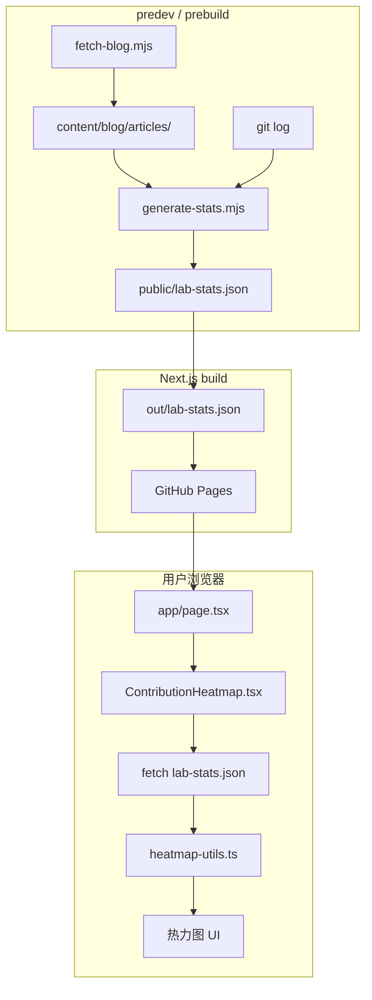

# 实验室脉搏：用 GitHub 风格热力图展示实验室活跃度

在 [上一篇文章](/article?slug=lab-web-blog-auto-fetch-howto) 里，我们已经让 IoT-lab-web 在 build 时自动从 [EMU-Stu-Blog](https://github.com/EMU-Stu/EMU-Stu-Blog) 拉取带 `labs: [IoT-Lab]` 的技术文章，并在 `/blog` 路由展示。

接下来要做的是：**把「写代码」和「写博客」这两类活跃行为，汇总成一张 GitHub 风格的热力图**，挂在实验室首页，一眼看出实验室最近忙不忙。

我们把这套能力叫做 **实验室脉搏（Lab Pulse）**。

## 设计目标

| 目标 | 做法 |
|------|------|
| 不依赖主站 CDN | 不用 EMU-Stu-Site 的 `stats.json`，数据在 build 前本地生成 |
| 适配静态导出 | `output: "export"`，不在 build 时调 GitHub API |
| 与博客链路衔接 | 博客数据来自 `fetch-blog` 拉下来的 `content/blog/articles/` |
| 只统计本实验室 | 博客按 frontmatter 的 `labs` 过滤，与 `lib/blog.ts` 一致 |

统计两类数据源：

1. **本站 Git 提交**：`IOT-lab-web` 仓库的 `git log`（按 commit 日期计数）
2. **实验室博客发文**：EMU-Stu-Blog 里 `labs` 含 `IoT-Lab` 的文章（按 frontmatter 的 `date` 计数）

## 整体链路



一句话概括：

> **build 前脚本写 JSON → public 静态托管 → 首页 Client Component fetch → 工具函数算格子 → 渲染热力图**

## 第一步：串联 package.json 钩子

博客文章必须先拉下来，统计脚本才能扫到 Markdown。因此在 `package.json` 里把两个脚本**按顺序**串起来：

```json
{
  "scripts": {
    "fetch-blog": "node scripts/fetch-blog.mjs",
    "generate-stats": "node scripts/generate-stats.mjs",
    "predev": "node scripts/fetch-blog.mjs && node scripts/generate-stats.mjs",
    "prebuild": "node scripts/fetch-blog.mjs && node scripts/generate-stats.mjs",
    "dev": "next dev --turbopack",
    "build": "next build"
  }
}
```

执行顺序：

```
npm run dev / build
    ↓
predev / prebuild
    ↓
① fetch-blog.mjs   →  clone EMU-Stu-Blog 到 content/blog/
    ↓
② generate-stats.mjs → 读 git log + 博客 → 写 public/lab-stats.json
    ↓
next dev / build
```

`public/lab-stats.json` 写进 `.gitignore`，不提交仓库；每次 dev/build 重新生成，保证数据最新。

## 第二步：generate-stats.mjs 做了什么

脚本路径：`scripts/generate-stats.mjs`

### 输出格式

写入 `public/lab-stats.json`，结构如下：

```json
{
  "2026-05-27": {
    "commits": 2,
    "articles": 1
  },
  "2026-06-06": {
    "commits": 1,
    "articles": 0
  }
}
```

- **key**：日期 `YYYY-MM-DD`
- **commits**：当天 `IOT-lab-web` 仓库的 commit 次数
- **articles**：当天发布的、带 `labs: [IoT-Lab]` 的 Blog 文章篇数

只保留 `2025-05-01` 及之后的记录（与热力图展示起点一致）。

### 函数一览

| 函数 | 作用 |
|------|------|
| `getLabCodes(data)` | 从 frontmatter 读取 `labs` 或 `lab`，统一成字符串数组 |
| `belongsToLab(data)` | 判断文章是否属于本实验室（大小写不敏感，如 `IOT-Lab` ≈ `IoT-Lab`） |
| `normalizeDate(raw)` | 把 frontmatter 的 `date` 规范成 `YYYY-MM-DD` |
| `collectGitCommits(statsMap)` | 执行 `git log --date=short`，按天累加 `commits` |
| `collectLabArticles(statsMap)` | 扫描 `content/blog/articles/*.md`，过滤后按天累加 `articles` |
| `main()` | 合并两类数据，`fs.writeFileSync` 写入 JSON |

### collectGitCommits：统计代码提交

```javascript
const log = execFileSync("git", ["log", "--pretty=format:%ad", "--date=short"], {
  cwd: root,
  encoding: "utf8",
});

for (const date of log.split("\n").filter(Boolean)) {
  if (date < STATS_START) continue;
  if (!statsMap[date]) statsMap[date] = { commits: 0, articles: 0 };
  statsMap[date].commits += 1;
}
```

每个 commit 对应一行日期；同一天多次提交会让 `commits` 累加。

> **CI 注意**：GitHub Actions 默认浅克隆只有 1 条 commit。需在 `deploy.yml` 里设置 `fetch-depth: 0`，否则线上热力图几乎为空：

```yaml
- uses: actions/checkout@v4
  with:
    fetch-depth: 0
```

### collectLabArticles：统计博客发文

```javascript
for (const file of fs.readdirSync(articlesDir).filter((f) => f.endsWith(".md"))) {
  const { data } = matter(fs.readFileSync(...));
  if (!belongsToLab(data)) continue;

  const date = normalizeDate(data.date);
  if (!date || date < STATS_START) continue;

  statsMap[date].articles += 1;
}
```

与 `lib/blog.ts` 使用相同的 `labs` 过滤逻辑：**只有会出现在 `/blog` 列表里的文章，才会计入热力图**。

投稿时在 EMU-Stu-Blog 写好 frontmatter 即可：

```yaml
---
title: 我的文章
author: 张三
date: 2026-06-19
labs: [IoT-Lab]
---
```

### main：写入 public

```javascript
function main() {
  const statsMap = {};
  collectGitCommits(statsMap);
  collectLabArticles(statsMap);

  fs.writeFileSync(outputPath, JSON.stringify(statsMap, null, 2));
}
```

Next.js 会把 `public/lab-stats.json` 原样拷贝到 `out/`，浏览器通过 URL 访问：

| 环境 | 路径 |
|------|------|
| 本地 dev | `/lab-stats.json` |
| GitHub Pages | `/IOT-lab-web/lab-stats.json`（需加 `basePath`） |

## 第三步：前端如何消费 lab-stats.json

### 挂载位置

首页 `app/page.tsx`，Hero 区域下方：

```tsx
import { ContributionHeatmap } from "@/components/ContributionHeatmap";

export default function HomePage() {
  return (
    <div className="space-y-14">
      {/* Hero ... */}
      <ContributionHeatmap />
      {/* 模块卡片 ... */}
    </div>
  );
}
```

目前**只有首页**使用这份数据。

### ContributionHeatmap.tsx

Client Component（`'use client'`），页面加载后在浏览器里 fetch：

```typescript
useEffect(() => {
  const url = `${siteConfig.basePath}/lab-stats.json`;
  fetch(url, { cache: "no-store" })
    .then((res) => res.json())
    .then((data) => setStats(data));
}, []);
```

为什么不在 build 时读 JSON 写进 HTML？

- 热力图是**客户端交互**（hover 看 tooltip）
- 数据文件放在 `public/`，和静态图片一样，由浏览器按需拉取
- 与博客模块不同：博客是 build 时 `fs.readFileSync` 生成静态 HTML

### heatmap-utils.ts：格子怎么算

| 函数 | 作用 |
|------|------|
| `beijingTodayStr()` | 取北京时间「今天」，作为网格右边界 |
| `buildHeatmapCells(stats)` | 从 `2025-05-01` 到今天，生成每天一个格子（7 行 × N 列） |
| `heatmapColumns(cells)` | 按「周」分列，对齐 GitHub 布局 |
| `summarizeHeatmap(cells)` | 汇总活跃天数、总提交、总博客篇数 |

活跃度打分（决定绿色深浅）：

```typescript
score = commits + articles * 2   // 发文权重略高于单次提交

level 0: 无活动
level 1: score === 1
level 2: score <= 3
level 3: score <= 6
level 4: score > 6
```

### 颜色含义

| 颜色 | 含义 |
|------|------|
| 浅灰 | 无活动 |
| 绿色（4 档） | 仅有代码提交，越深越活跃 |
| 蓝色 | 仅有博客发文 |
| 紫色 | 同一天既有提交又有发文 |

站点主色 `#0071e3` 用于博客相关格子，与 lab-web 整体风格一致。

## 与主站热力图的对比

| | EMU-Stu-Site 主站 | IoT-lab-web 实验室脉搏 |
|---|-------------------|------------------------|
| 数据来源 | 组织 `stats-data/stats.json`（CDN） | 本地 build 生成 `lab-stats.json` |
| 统计口径 | 全组织代码变更行数 | 本站 commit 次数 + 本实验室博客篇数 |
| 生成时机 | Python 脚本 + 定时 Action | `generate-stats.mjs` + prebuild |
| 展示位置 | 弹窗（按钮打开） | 首页内嵌 section |

实验室站更轻量，且与 Blog 的 `labs` 过滤体系完全打通。

## 部署与自动更新

1. **本站有 commit** → push `IOT-lab-web` → CI rebuild → `git log` 更新 → 热力图变绿
2. **Blog 有新文** → EMU-Stu-Blog 合并 → `repository_dispatch` 触发 lab-web rebuild → `fetch-blog` 拉新文章 → `generate-stats` 计入 → 对应日期变蓝

Blog 仓库的 workflow 需同时 notify 主站和 `IOT-lab-web`（`docs-updated` 事件），与博客展示链路共用同一套触发机制。

## 关键文件索引

| 文件 | 作用 |
|------|------|
| `scripts/generate-stats.mjs` | build 前生成 `lab-stats.json` |
| `public/lab-stats.json` | 静态数据（gitignore，不提交） |
| `lib/lab-stats-types.ts` | TypeScript 类型 |
| `lib/heatmap-utils.ts` | 网格与汇总算法 |
| `components/ContributionHeatmap.tsx` | 首页热力图 UI |
| `app/page.tsx` | 挂载组件 |
| `.github/workflows/deploy.yml` | `fetch-depth: 0` 保证完整 git 历史 |

## 小结

**实验室脉搏**把两类已有能力串在一起：

- **fetch-blog**：Blog 内容进 `content/blog/`
- **generate-stats**：Git 提交 + 实验室博客 → `public/lab-stats.json`
- **ContributionHeatmap**：浏览器读 JSON，画出 GitHub 风格热力图

不依赖主站 CDN，不破坏静态导出，Blog 更新后 rebuild 即可同步。若你也在维护其它实验室门户，只需改 `LAB_CODE` / `siteConfig.labCode`，其余逻辑可复用。
