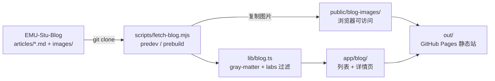

# 物联网实验室站点如何从 EMU-Stu-Blog 自动拉取博客

EMU-Stu 组织里，博客文章统一存放在 [EMU-Stu-Blog](https://github.com/EMU-Stu/EMU-Stu-Blog) 内容仓库；主站 [EMU-Stu-Site](https://github.com/EMU-Stu/EMU-Stu-Site) 在 build 时拉取全部文章展示。各实验室还有独立门户站（如 [IoT-lab-web](https://github.com/EMU-Stu/IOT-lab-web)），只需要展示**本实验室**的文章。

这篇文章以 IoT-lab-web（Next.js + GitHub Pages）为例，说明如何实现：**build 前自动拉取 Blog 仓库 → 按 `labs` 过滤 → 静态页面渲染 → 图片正确显示**。

## 整体架构



三个仓库的职责：

| 仓库 | 角色 |
|------|------|
| **EMU-Stu-Blog** | 唯一内容源，Markdown + 图片 |
| **EMU-Stu-Site** | 主站，展示全部文章（Vite） |
| **IoT-lab-web** | 物联网实验室门户，只展示 `labs: [IoT-Lab]` 的文章（Next.js） |

**为什么不从 Site 读，而直接从 Blog 读？** Site 的 `frontend/docs/` 是 gitignore 的临时目录，不在仓库里；两个展示站应共享同一份内容源，各自做过滤。

## 第一步：build 前拉取博客

`scripts/fetch-blog.mjs` 在 `npm run dev` / `npm run build` 之前自动执行（通过 `package.json` 的 `predev` / `prebuild` 钩子）。

核心逻辑：

1. 若 `content/blog/.git` 存在 → `git fetch` + `git reset --hard` 更新
2. 否则 → 浅克隆 `EMU-Stu-Blog` 到 `content/blog/`
3. 将 `content/blog/articles/images/` 复制到 `public/blog-images/`

```javascript
// scripts/fetch-blog.mjs（节选）
const REPO = process.env.BLOG_REPO ?? "https://github.com/EMU-Stu/EMU-Stu-Blog.git";
const BLOG_DIR = path.join(root, "content", "blog");
const IMAGES_DST = path.join(root, "public", "blog-images");

// clone 或更新
if (existsSync(path.join(BLOG_DIR, ".git"))) {
  git(["fetch", "--depth", "1", "origin", BRANCH], { cwd: BLOG_DIR });
  git(["reset", "--hard", `origin/${BRANCH}`], { cwd: BLOG_DIR });
} else {
  git(["clone", "--depth", "1", "--branch", BRANCH, REPO, BLOG_DIR]);
}

// 复制图片到 public/
for (const file of readdirSync(IMAGES_SRC)) {
  cpSync(path.join(IMAGES_SRC, file), path.join(IMAGES_DST, file));
}
```

`content/blog/` 和 `public/blog-images/` 都写进了 `.gitignore`，不提交进 lab-web 仓库；本地和 CI 每次 build 现拉最新。

`package.json` 配置：

```json
{
  "scripts": {
    "fetch-blog": "node scripts/fetch-blog.mjs",
    "predev": "node scripts/fetch-blog.mjs",
    "prebuild": "node scripts/fetch-blog.mjs",
    "dev": "next dev --turbopack",
    "build": "next build"
  }
}
```

## 第二步：解析 Markdown 并按实验室过滤

`lib/blog.ts` 负责读取 `content/blog/articles/*.md`，用 `gray-matter` 解析 frontmatter，只保留属于本实验室的文章。

### frontmatter 约定

投稿时在 EMU-Stu-Blog 的文章顶部标注所属实验室：

```yaml
---
title: 文章标题
author: 张三
date: 2026-06-06
category: 技术分享
labs: [IoT-Lab]
---
```

`labs` 支持数组或单值，大小写不敏感（`IOT-Lab` 与 `IoT-Lab` 均可匹配）。

### 过滤逻辑

```typescript
// lib/site-config.ts
export const siteConfig = {
  labCode: "IoT-Lab",
  basePath: isGithubPages ? "/IOT-lab-web" : "",
  // ...
};

// lib/blog.ts
function belongsToLab(data: Record<string, unknown>): boolean {
  const codes = getLabCodes(data); // 读 labs 或 lab 字段
  const target = siteConfig.labCode.toLowerCase();
  return codes.some((code) => code.toLowerCase() === target);
}
```

对外暴露两个 API：

- `listLabBlogPosts()` — 列表页，按 date 倒序
- `readLabBlogPost(slug)` — 详情页，不属于本实验室返回 `null`

主站 EMU-Stu-Site **不过滤**，继续展示全部；各实验室站只改 `labCode` 即可复用同一套 Blog 内容。

## 第三步：Next.js 页面

沿用 App Router + 静态导出（`output: "export"`）模式，和「未来指引」模块结构一致：

| 路由 | 文件 | 作用 |
|------|------|------|
| `/blog` | `app/blog/page.tsx` | 文章列表 |
| `/blog/[slug]` | `app/blog/[slug]/page.tsx` | 文章详情 |

详情页需要 `generateStaticParams()` 预渲染所有 slug（静态导出要求）：

```typescript
export async function generateStaticParams() {
  return listLabBlogPosts().map((post) => ({ slug: post.slug }));
}
```

正文用 `react-markdown` + `remark-gfm` 渲染，组件为 `MarkdownBody`。

## 第四步：图片为什么必须复制到 public/

Blog 原文写法：

```markdown

```

clone 后图片在 `content/blog/articles/images/`，但 **Next.js 不会把 `content/` 暴露给浏览器**。静态资源必须放在 `public/`：

```
public/blog-images/stats-inline.png  →  /blog-images/stats-inline.png
```

读取 Markdown 时自动替换路径（作者**无需**改 Blog 源文件）：

```typescript
function normalizeBlogImagePaths(content: string): string {
  const prefix = siteConfig.basePath;
  return content.replace(
    /!\[([^\]]*)\]\((?!https?:\/\/)(\.\/)?images\/([^)]+)\)/g,
    ``,
  );
}
```

### GitHub Pages 子路径陷阱

站点部署在 `https://emu-stu.github.io/IOT-lab-web/`，Next.js 的 `basePath` 为 `/IOT-lab-web`。`<Link>` 和 CSS 会自动加前缀，但 **react-markdown 生成的 `` 不会**，必须手动加：

| 环境 | 正确图片路径 |
|------|-------------|
| 本地 dev | `/blog-images/xxx.png` |
| GitHub Pages | `/IOT-lab-web/blog-images/xxx.png` |

`site-config.ts` 与 `next.config.ts` 共用同一 `basePath`，避免两处不一致。

## 第五步：CI 部署

GitHub Actions 在 build 时设置 `GITHUB_PAGES=true`，触发 basePath 和图片前缀：

```yaml
- run: npm run build
  env:
    GITHUB_PAGES: "true"
    NEXT_PUBLIC_SITE_URL: https://emu-stu.github.io/IOT-lab-web
```

`prebuild` 会自动跑 `fetch-blog`，CI 无需单独 clone Blog。

## 与 EMU-Stu-Site 主站对比

| | Site（Vite） | lab-web（Next.js） |
|---|-------------|-------------------|
| clone 目标 | `frontend/docs/` | `content/blog/` |
| 读 Markdown | `import.meta.glob` | `fs` + `gray-matter` |
| 实验室过滤 | 无 | `labs` frontmatter |
| 图片处理 | Vite 中间件 + build 拷到 `dist/images/` | fetch 时拷到 `public/blog-images/` |
| 浏览器路径 | `/images/xxx` | `{basePath}/blog-images/xxx` |

思路相同：**内容源 clone → 解析 → 图片放到浏览器可访问目录 → 改 Markdown 路径**；差异来自 Vite 与 Next.js 的静态资源模型不同。

## 投稿与更新流程

1. 在 **EMU-Stu-Blog** 写稿，frontmatter 加 `labs: [IoT-Lab]`
2. PR 合并后 Blog 仓库更新
3. **IoT-lab-web** push 或手动触发 deploy → `prebuild` 拉最新 Blog → 重新 build
4. 本实验室文章自动出现在 `/blog`

作者只需维护 Blog 仓库，**不用**改 lab-web，**不用**改图片路径。

## 给其他实验室复用

Fork IoT-lab-web，改 `lib/site-config.ts` 里的 `labCode`（如 `Ark-Lab`、`Blade-Sec-Lab`），投稿时在 frontmatter 写对应 `labs` 即可。fetch、解析、页面逻辑无需改动。

## 关键文件索引

| 文件 | 作用 |
|------|------|
| `scripts/fetch-blog.mjs` | clone Blog + 复制图片 |
| `lib/blog.ts` | 解析、过滤、改图片路径 |
| `lib/site-config.ts` | `labCode`、`basePath` |
| `app/blog/page.tsx` | 列表页 |
| `app/blog/[slug]/page.tsx` | 详情页 |
| `next.config.ts` | 静态导出 + basePath |
| `.github/workflows/deploy.yml` | GitHub Pages 部署 |

## 小结

IoT-lab-web 的博客模块实现了**内容仓库与展示仓库分离**：Blog 只管写文章，lab-web 在 build 前自动拉取、按实验室过滤、静态渲染。图片通过复制到 `public/` 并在解析时替换路径解决；GitHub Pages 子路径部署时需给图片 URL 加上 `basePath` 前缀。

若你在组织内维护其他实验室站点，欢迎复用这套模式，并在 EMU-Stu-Blog 投稿时记得标注 `labs` 字段。
